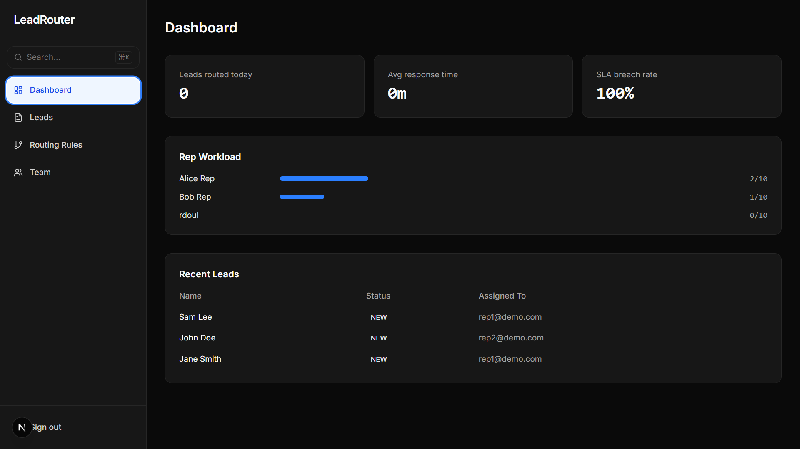
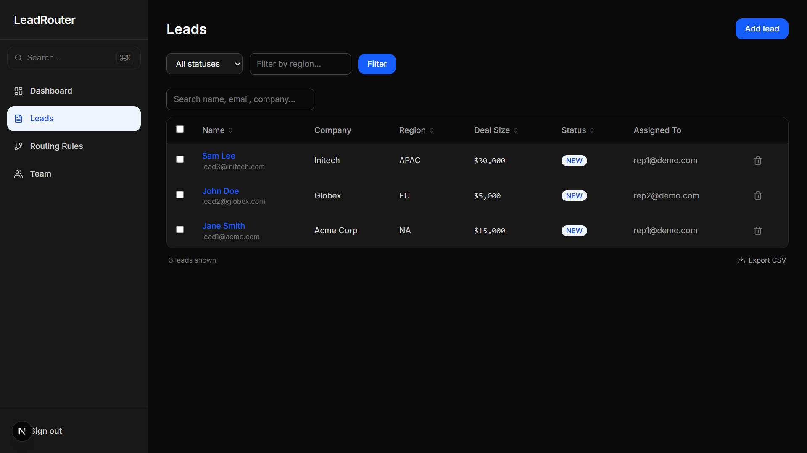
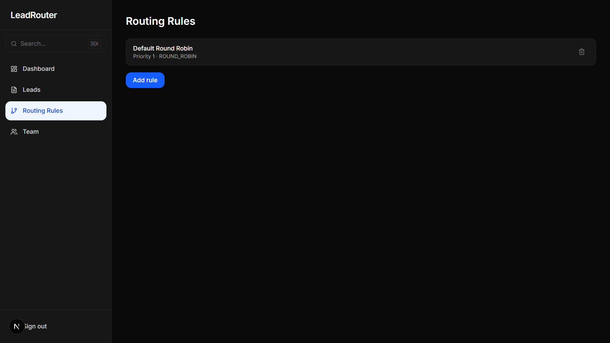

# LeadRouter

> Automatically route inbound leads to the right sales rep — with configurable priority rules, real-time SLA tracking, and a full audit log.

[](https://github.com/Roul-max/Digital-Heroes/actions/workflows/ci.yml)
[](LICENSE)
[](tsconfig.json)

**[Live Demo →](https://digitalhros.vercel.app)**

Demo credentials — Admin: `demo@demo.com` / Rep: `rep1@demo.com` · password: `demo1234`



---

## Features

- **Automatic lead routing** — priority-ordered rules match on region, deal size, and product line; first match wins
- **Round-robin & direct assignment** — fair distribution across reps or pin high-value accounts to a specific rep
- **Rep capacity enforcement** — leads queue to backlog when all reps are at capacity
- **Real-time SLA countdown** — live timer per lead; turns amber at 30 min remaining, red on breach
- **Admin dashboard** — leads routed today, avg response time, SLA breach rate, and per-rep workload bars
- **Immutable audit log** — every routing decision and status change recorded with actor + timestamp; append-only
- **CSV export** — full leads table, rate-limited and streamed (no timeout on large sets)
- **Bulk actions** — multi-select with select-all-across-pages and confirm-gated destructive operations
- **Sortable & filterable table** — sort by name, region, deal size, or status; filters mirrored to URL
- **Email verification + password reset** — single-use SHA-256 hashed tokens, 30-min TTL
- **RBAC** — ADMIN and REP roles enforced server-side on every route and mutation
- **Accessible UI** — WCAG 2.1 AA, keyboard navigable (`/` search, `j/k` rows, `⌘K` palette), focus rings, skip-to-content

## Tech Stack

| Layer | Choice |
|---|---|
| Framework | Next.js 15, App Router, TypeScript strict |
| Database | PostgreSQL via Prisma (Supabase / Neon) |
| Auth | Auth.js (NextAuth v5), Credentials provider |
| Styling | Tailwind CSS v4, system-aware dark mode |
| Validation | Zod on every boundary |
| Email | Resend |
| Rate Limiting | Upstash Redis (in-memory fallback for dev) |
| Testing | Vitest |
| CI | GitHub Actions |
| Deploy | Vercel |

## Quick Start

```bash
git clone https://github.com/Roul-max/Digital-Heroes
cd Digital-Heroes
cp .env.example .env.local        # fill in your values (see table below)
npm install
npm run db:migrate                 # run Prisma migrations
npm run db:seed                    # seed demo data (demo@demo.com / demo1234)
npm run dev                        # http://localhost:3000
```

## Environment Variables

| Variable | Required | Description |
|---|---|---|
| `DATABASE_URL` | ✅ | PostgreSQL connection string — use port `6543` with `?pgbouncer=true&connection_limit=1` for Supabase |
| `DIRECT_URL` | ✅ | Same connection string but port `5432` — used by Prisma migrations |
| `NEXTAUTH_SECRET` | ✅ | Random 32+ char string — `openssl rand -base64 32` |
| `NEXTAUTH_URL` | — | Full URL of your deployment (default: `http://localhost:3000`) |
| `RESEND_API_KEY` | ✅ | API key from [resend.com](https://resend.com) |
| `EMAIL_FROM` | — | Sender address (default: `noreply@leadrouter.app`) |
| `SLA_HOURS` | — | Hours before a lead is SLA-breached (default: `2`) |
| `UPSTASH_REDIS_REST_URL` | — | Upstash Redis URL for multi-instance rate limiting |
| `UPSTASH_REDIS_REST_TOKEN` | — | Upstash Redis token |
| `GOOGLE_CLIENT_ID` | — | Google OAuth client ID |
| `GOOGLE_CLIENT_SECRET` | — | Google OAuth client secret |
| `GITHUB_CLIENT_ID` | — | GitHub OAuth client ID |
| `GITHUB_CLIENT_SECRET` | — | GitHub OAuth client secret |

## Architecture

See [`docs/architecture.md`](docs/architecture.md) for the full data model diagram, auth/authz explanation, and key trade-off decisions.

**In brief:**
- JWT sessions with role embedded in token — no DB hit in middleware
- Routing engine evaluates rules in ascending priority order; first match wins
- All timestamps stored in UTC; SLA rendered in the client's local timezone
- Audit log is append-only — no updates, no soft-delete
- Cursor/keyset pagination — stable under concurrent inserts, no page drift past 10k rows
- PgBouncer transaction mode pooler for serverless connection management

## Testing

```bash
npm run test           # Vitest unit tests
npm run test:coverage  # Coverage report
npm run typecheck      # TypeScript strict check
npm run lint           # ESLint
```

## Deployment (Vercel)

1. Push repo to GitHub
2. Import at [vercel.com](https://vercel.com) — auto-detects Next.js
3. Add all env vars from the table above under **Settings → Environment Variables**
4. Provision a Postgres DB (Supabase or Neon) and set both `DATABASE_URL` and `DIRECT_URL`
5. Migrations run automatically on deploy via `vercel.json`
6. Seed demo data: `npx tsx prisma/seed.ts`

Every push to `main` auto-deploys. Every PR gets a preview URL.

## Keyboard Shortcuts

| Shortcut | Action |
|---|---|
| `⌘K` / `Ctrl+K` | Open command palette |
| `/` | Focus search input |
| `j` / `k` | Navigate table rows |
| `Esc` | Close palette / modal |

## Screenshots





## Roadmap

- [ ] Webhook intake endpoint (`POST /api/leads/ingest`) for CRM integrations
- [ ] Configurable SLA per routing rule (not just global)
- [ ] Playwright e2e tests
- [ ] OAuth providers (Google, GitHub) via Auth.js
- [ ] Upstash Redis rate limiter for multi-instance deploys

## Demo Credentials

| Role | Email | Password |
|---|---|---|
| Admin | `demo@demo.com` | `demo1234` |
| Rep | `rep1@demo.com` | `demo1234` |

## Contributing

See [CONTRIBUTING.md](CONTRIBUTING.md) for setup, branch strategy, and commit conventions.

## License

[MIT](LICENSE)

---

Built as part of the [Digital Heroes](https://digitalheroes.dev) Full Stack Developer Trial.
